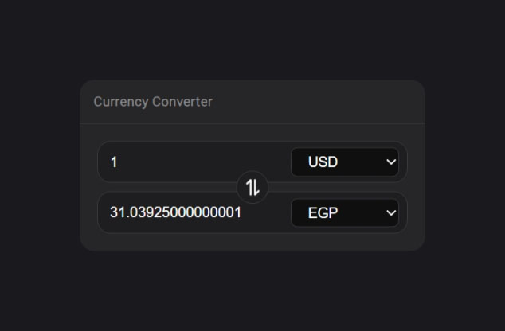

# Currency Converter

This is a simple web app that allows you to convert between different currencies using the latest exchange rates from [CurrencyFreaks API](https://currencyfreaks.com/).

## Features

-   Choose from over 400 currencies
-   You can enter any amount in the first input field and select the currency type from the dropdown menu.
-   You can see the converted amount in the second input field and select the currency type from the dropdown menu.
-   You can switch the currency types by clicking on the switch icon.
-   The app will automatically update the converted amount as you change the input value or the currency type.

## Technologies

-   HTML
-   CSS
-   JavaScript
-   Fetch API
-   CurrencyFreaks API

## Screenshots

